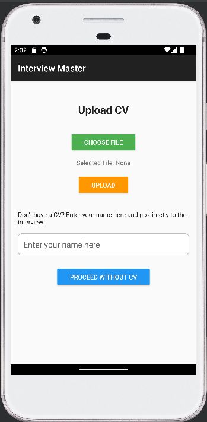
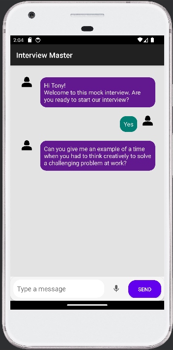

# Interview Master

Interview Master is an innovative platform designed to help users prepare for job interviews or even conduct real interviews. We've eliminated the traditional barriers that required extensive inputs by simplifying and making the process more interactive using artificial intelligence. This transformation allows for a more user-friendly experience, enabling users to engage in practice interviews that closely mimic real-world scenarios. By leveraging AI, Interview Master offers personalized feedback, tips, and strategies to improve interview skills, ensuring that users are well-prepared and confident for their next job interview. 

## How To Run

### Backend and Frontend
1. Clone the whole repository
2. Create a new .env file in the root folder
```
PORT=<CHANGE_THIS_ANY_PORT_NUMBER_YOU_WANT>
OPENAI_API_KEY=<CHANGE_THIS_WITH_YOUR_SECRET_OPEN_AI_KEY>
```
3. Open terminal in the root folder
4. Execute these commands
```
npm install
npm run dev
```
5. You can access the BE in localhost:[PORT] and the FE in localhost:5173
Note: 5173 is the default port for vue. Please make sure your 5173 port is free or check your vue configuration
### Mobile App 
1. Open Android Studio
2. Open project (root/mobileapp)
3. Build and run the APK
Note-1: This app is automatically connected to the local BE at localhost (using 10.0.2.2). If you want to deploy the backend on another server, you need to change the BASE_URL in the [root\mobileapp\app\src\main\java\com\eaters\eaters\RetrofitClient.kt] with your own url
Note-2: You might find a problem for installing the apk to your physical device since the newer SDK is only can be installed through the Play Store through the bundle. If this problem occurs, go to the step 4
4. Enable Developer Mode on your device
5. Turn on the USB Debugging
6. Connect the device to the Android Studio
7. Run it as an ADB

## Contributor
- [Lemon](https://github.com/Lemonwsl)
- [Dyas](https://github.com/Lemonwsl)
- [Rehan](https://github.com/rehanadi30)
- [Hotodogu](https://github.com/hotodogu)

## Documentation

<p align="center">
  
  
  <br>
  Screenshot of Interview Master Mobile App
</p>

- Google docs: https://docs.google.com/document/d/1a9Z8jIa2oaUzu4WH8hZciyKXTB4ey_ygO8hj8cFnjUo/edit?usp=sharing


## Add pdf
to use pdf analyzer, add pdf in the root folder